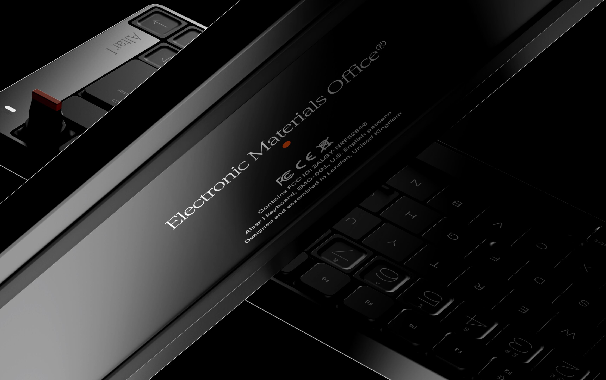

Electronic Materials Office® is a future-oriented consumer hardware corporation.

## Manifesto

01. The world is fucked unless we, collectively, do something about it.
02. Sustainability is luxury.
03. Everything in black.
04. Well paid workers. Good working conditions.
05. Simply + thoughtfully designed.
06. Made for longevity.

## Altar I

Altar I is an ultra-low profile wireless mechanical keyboard made by Electronic Materials Office®. Altar I firmware is open source.

- [Altar I Keyboard Firmware](https://github.com/electronicmaterialsoffice/firmware-altar-i.git) — Firmware repository for Altar I.
## ZMK

Electronic Materials Office® keyboard firmware is based on the open-source [Zephyr Mechanical Keyboard (ZMK) Project](https://zmk.dev/).

EMO® contributes its firmware development efforts back to the ZMK community where possible.

- [ZMK Studio CLI](https://github.com/electronicmaterialsoffice/zmk-studio-cli) — Command line interface for interacting with ZMK Studio enabled keyboards
- [ZMK Studio Messages](https://github.com/electronicmaterialsoffice/zmk-studio-messages) — Custom ZMK RPC Protocol messages for ZMK Studio features unique to Electronic Materials Office® keyboards
